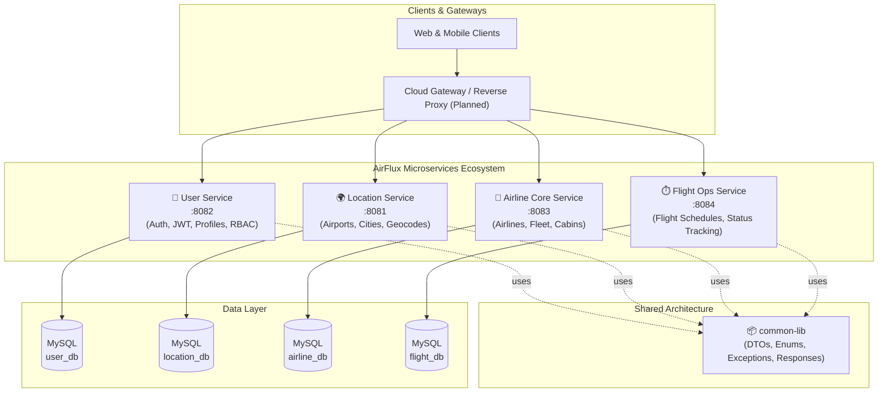
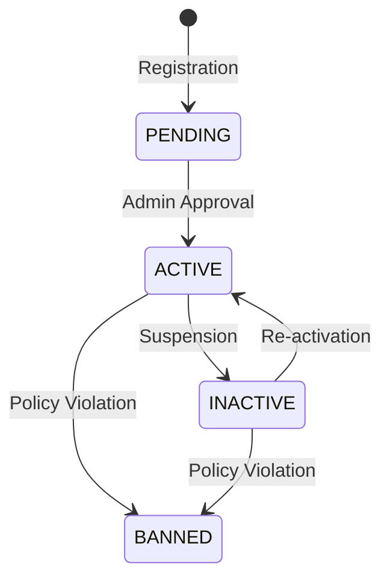
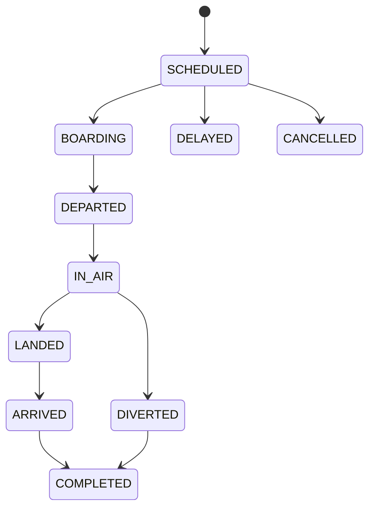

# ✈️ AirFlux

<p align="center">
  <strong>Next-Generation Distributed Airline Management & Flight Operations Platform (Under Development)</strong>
</p>

<p align="center">
  
  
  
  
  
  
  
</p>

---

## 📖 Table of Contents

- [Overview](#-overview)
- [System Architecture](#-system-architecture)
- [Microservices Portfolio](#-microservices-portfolio)
- [Technology Stack](#-technology-stack)
- [Domain & Data Models](#-domain--data-models)
- [API Reference](#-api-reference)
  - [1. User Service](#1-user-service-port-8082)
  - [2. Location Service](#2-location-service-port-8081)
  - [3. Airline Core Service](#3-airline-core-service-port-8083)
  - [4. Flight Operations Service](#4-flight-operations-service-port-8084)
- [Error Handling Strategy](#-error-handling-strategy)
- [Getting Started](#-getting-started)
  - [Prerequisites](#prerequisites)
  - [Database Setup](#database-setup)
  - [Environment Configuration](#environment-configuration)
  - [Building the Project](#building-the-project)
  - [Running the Services](#running-the-services)
- [Project Directory Structure](#-project-directory-structure)
- [Roadmap](#-roadmap)
- [Contributing](#-contributing)
- [License](#-license)

---

## 🌟 Overview

**AirFlux** is an enterprise-grade, distributed microservices platform engineered to power end-to-end commercial aviation operations. Designed following Domain-Driven Design (DDD) principles and modern microservice architecture, AirFlux seamlessly coordinates user access, geographical navigation data, fleet lifecycle management, airline administrative controls, and flight schedules.

### Key Highlights
- **Distributed Microservices**: Decoupled, independently deployable services organized under a modular Maven multi-project structure.
- **Role-Based Access Control (RBAC)**: Secure authentication and fine-grained authorization for `ROLE_SYSTEM_ADMIN`, `ROLE_AIRLINE_OWNER`, and `ROLE_USER`.
- **Global Aviation Master Data**: Standardized IATA/ICAO codes, geographic coordinates, nested address hierarchies, and timezone-aware schedule lookups.
- **Fleet & Cabin Management**: Multi-tier seating configurations (Economy, Premium Economy, Business, First Class), operational telemetry, and automated maintenance scheduling.
- **Standardized Communication**: Unified API responses (`ApiResponse`), detailed RFC 7807-compatible error structures (`ErrorResponse`), and a shared core payload library (`common-lib`).

---

## 🏗️ System Architecture



---

## 📦 Microservices Portfolio

| Service | Port | Context Path | Primary Responsibility | Database |
| :--- | :---: | :--- | :--- | :--- |
| **`common-lib`** | — | — | Shared DTOs, Enums, global exception handlers, and utility models | — |
| **`userService`** | `8082` | `/api/v1` | Authentication, JWT issuing, user registration, role enforcement | `MySQL` |
| **`locationService`** | `8081` | `/api/v1` | Airport catalogs, global city directory, geographic coordinates | `MySQL` |
| **`airlineCoreService`** | `8083` | `/api/v1` | Airline registration, admin verification, aircraft fleet & seat configurations | `MySQL` |
| **`flightOpsService`** | `8084` | `/api/v1` | Flight schedule creation, route tracking, and lifecycle status transitions | `MySQL` |
| **`cloud`** *(Roadmap)* | — | — | Cloud infrastructure (API Gateway, Eureka Service Registry, Config Server) | — |

---

## 💻 Technology Stack

- **Backend Platform**: Java 17 (LTS)
- **Framework**: Spring Boot 4.x / Spring WebMVC
- **Cloud Foundation**: Spring Cloud (Release Train `2025.1.3`)
- **Persistence & ORM**: Spring Data JPA, Hibernate ORM
- **Database**: MySQL 8.0+
- **Security & Tokens**: Spring Security (Stateless filter chain), JJWT `0.13.0`
- **Validation**: Jakarta Bean Validation (`hibernate-validator`)
- **Code Generation**: Project Lombok
- **Build System**: Apache Maven (Multi-module)

---

## 📊 Domain & Data Models

### Enums & State Machines

#### `UserRole`
- `ROLE_SYSTEM_ADMIN`: Platform superuser with approval/suspension authority.
- `ROLE_AIRLINE_OWNER`: Airline manager responsible for fleet and flight operations.
- `ROLE_USER`: Standard customer accessing travel information and booking.

#### `AirlineStatus`


#### `AircraftStatus`
- `ACTIVE`: Available for scheduled flight operations.
- `MAINTENANCE`: Under routine inspection or repair.
- `GROUNDED`: Temporarily restricted from flight.
- `RETIRED`: Decommissioned from the fleet.

#### `FlightStatus`


---

## 🚀 API Reference

### 1. User Service (Port: `8082`)

Base URL: `http://localhost:8082/api/v1`

#### Auth Endpoints (`/auth`)

| Method | Endpoint | Description | Auth Required |
| :--- | :--- | :--- | :---: |
| `POST` | `/auth/signup` | Register a new user account | ❌ |
| `POST` | `/auth/login` | Authenticate user & receive JWT token | ❌ |

##### `POST /auth/signup` Request Body:
```json
{
  "fullName": "Captain John Doe",
  "email": "john.doe@airflux.com",
  "password": "SecurePassword123!",
  "phoneNumber": "+1-555-0199",
  "role": "ROLE_AIRLINE_OWNER"
}
```

##### `POST /auth/login` Response (`AuthResponse`):
```json
{
  "jwt": "eyJhbGciOiJIUzI1NiJ9...",
  "message": "Login Success",
  "role": "ROLE_AIRLINE_OWNER"
}
```

#### User Profile Endpoints (`/users`)

| Method | Endpoint | Headers | Description |
| :--- | :--- | :--- | :--- |
| `GET` | `/users/profile` | `X-User-Email: <email>` | Get current authenticated user profile |
| `GET` | `/users/{id}` | — | Get user profile by numeric ID |
| `GET` | `/users/all` | — | Retrieve all registered users |

---

### 2. Location Service (Port: `8081`)

Base URL: `http://localhost:8081/api/v1`

#### City Management (`/cities`)

| Method | Endpoint | Query / Path Params | Description |
| :--- | :--- | :--- | :--- |
| `POST` | `/cities` | — | Add a new city to the catalog |
| `GET` | `/cities/{cityId}` | `{cityId}` | Fetch city by primary key |
| `GET` | `/cities` | `page=0&size=20&sortBy=name&sortDirection=asc` | Paginated list of cities |
| `PUT` | `/cities/{cityId}` | `{cityId}` | Update existing city details |
| `DELETE` | `/cities/{cityId}` | `{cityId}` | Remove city from catalog |
| `GET` | `/cities/search` | `keyword=London&page=0&size=10` | Search cities by keyword |
| `GET` | `/cities/country/{countryCode}` | `{countryCode}` | Retrieve cities by ISO country code |
| `GET` | `/cities/exists/{cityCode}` | `{cityCode}` | Check if city code already exists |

##### `POST /cities` Request Body:
```json
{
  "name": "London",
  "cityCode": "LON",
  "countryCode": "GB",
  "countryName": "United Kingdom",
  "regionCode": "ENG",
  "timeZone": "Europe/London"
}
```

#### Airport Management (`/airports`)

| Method | Endpoint | Description |
| :--- | :--- | :--- |
| `POST` | `/airports` | Create a new airport linked to a city |
| `GET` | `/airports/{id}` | Get airport details by ID |
| `GET` | `/airports` | Retrieve all registered airports |
| `GET` | `/airports/city/{cityId}` | Get all airports located in a specific city |
| `PUT` | `/airports/{id}` | Update airport details |
| `DELETE` | `/airports/{id}` | Delete airport record |

##### `POST /airports` Request Body:
```json
{
  "iataCode": "LHR",
  "name": "London Heathrow Airport",
  "cityId": 1,
  "timeZoneId": "Europe/London",
  "address": {
    "street": "Compass Centre, Nelson Road",
    "city": "Hounslow",
    "state": "Middlesex",
    "country": "United Kingdom",
    "postalCode": "TW6 2GW"
  },
  "geoCode": {
    "latitude": 51.4700,
    "longitude": -0.4543
  }
}
```

---

### 3. Airline Core Service (Port: `8083`)

Base URL: `http://localhost:8083/api/v1`

#### Airline Operations (`/airlines`)

| Method | Endpoint | Required Headers | Description |
| :--- | :--- | :--- | :--- |
| `POST` | `/airlines` | `X-User-Id: <id>` | Register new airline profile (Status: `ACTIVE`) |
| `GET` | `/airlines/admin` | `X-User-Id: <id>` | Get airline associated with the owner |
| `GET` | `/airlines/{airlineId}` | — | Fetch airline by ID |
| `GET` | `/airlines` | `page, size` | Paginated listing of all airlines |
| `GET` | `/airlines/dropdown` | — | Lightweight list for dropdown pickers |
| `PUT` | `/airlines` | `X-User-Id: <id>` | Update owned airline profile |
| `DELETE` | `/airlines/{airlineId}` | `X-User-Id: <id>` | Delete airline |
| `POST` | `/airlines/{airlineId}/approve`| — | Admin Action: Approve airline |
| `POST` | `/airlines/{airlineId}/suspend`| — | Admin Action: Suspend airline |
| `POST` | `/airlines/{airlineId}/ban` | — | Admin Action: Ban airline permanently |

##### `POST /airlines` Request Body:
```json
{
  "iataCode": "BA",
  "icaoCode": "BAW",
  "name": "British Airways",
  "alias": "Speedbird",
  "logoUrl": "https://assets.airflux.com/logos/ba.png",
  "website": "https://www.britishairways.com",
  "alliance": "Oneworld",
  "headQuaterCityId": 1,
  "support": {
    "email": "support@britishairways.com",
    "phone": "+44-20-8738-5050"
  }
}
```

#### Fleet / Aircraft Management (`/aircrafts`)

| Method | Endpoint | Required Headers | Description |
| :--- | :--- | :--- | :--- |
| `POST` | `/aircrafts` | `X-User-Id: <id>` | Add an aircraft to the airline fleet |
| `GET` | `/aircrafts/{aircraftId}` | — | Get aircraft technical specs by ID |
| `GET` | `/aircrafts` | `X-User-Id: <id>` | Get all aircraft owned by authenticated owner |
| `PUT` | `/aircrafts/{aircraftId}` | `X-User-Id: <id>` | Update aircraft configuration or status |
| `DELETE` | `/aircrafts/{aircraftId}` | `X-User-Id: <id>` | Delete aircraft from fleet |

##### `POST /aircrafts` Request Body:
```json
{
  "code": "G-XWBA",
  "model": "A350-1000",
  "manufacturer": "Airbus",
  "seatingCapacity": 331,
  "economySeats": 219,
  "premiumEconomySeats": 56,
  "businessSeats": 56,
  "firstClassSeats": 0,
  "maxAltitude": 41400,
  "rangeKm": 16100,
  "cruisingSpeedKmh": 903,
  "yearOfManufacture": 2019,
  "registrationDate": "2019-07-26",
  "nextMaintenanceDate": "2026-12-01",
  "aircraftStatus": "ACTIVE",
  "isAvailable": true,
  "currentAirportId": 1
}
```

---

### 4. Flight Operations Service (Port: `8084`)

Base URL: `http://localhost:8084/api/v1`

| Method | Endpoint | Description |
| :--- | :--- | :--- |
| `GET` | `/` | Health and service greeting endpoint |
| `POST` | `/flights` *(Service Interface)* | Create and schedule flight route |
| `GET` | `/flights/{id}` *(Service Interface)* | Fetch flight details by ID |
| `GET` | `/flights` *(Service Interface)* | Query flights filtered by airline, departure, arrival |
| `PUT` | `/flights/{id}` *(Service Interface)* | Update flight schedule or aircraft assignment |
| `PATCH` | `/flights/{id}/status` *(Service Interface)*| Transition flight state (`BOARDING`, `DEPARTED`, etc.) |
| `DELETE` | `/flights/{id}` *(Service Interface)* | Cancel and remove scheduled flight |

---

## 🛡️ Error Handling Strategy

AirFlux features centralized exception handling implemented in `common-lib` via `@RestControllerAdvice` in `GlobalExceptionHandler`. All microservices produce uniform, predictable error payloads:

```json
{
  "timestamp": "2026-09-21T12:00:00",
  "status": 404,
  "error": "Not Found",
  "message": "Airport with id 99 not found",
  "path": "/api/v1/airports/99"
}
```

### Handled Exception Mapping

| Exception | HTTP Status | Scenario |
| :--- | :---: | :--- |
| `ResourceNotFoundException` | `404 NOT FOUND` | Entity not found in database |
| `DuplicateResourceException` | `409 CONFLICT` | Unique constraint violated (e.g. duplicate email, IATA code) |
| `DataIntegrityViolationException` | `409 CONFLICT` | Foreign key or database constraint failure |
| `MethodArgumentNotValidException` | `400 BAD REQUEST` | Jakarta bean validation failed (e.g., blank fields, bad format) |
| `IllegalOperationException` | `400 BAD REQUEST` | Business rule breach (e.g., unauthorized status transition) |
| `InvalidCredentialsException` | `401 UNAUTHORIZED` | Invalid email or password during login |
| `HttpRequestMethodNotSupportedException` | `405 METHOD NOT ALLOWED` | Disallowed HTTP verb |
| `Exception` (Generic) | `500 INTERNAL SERVER ERROR` | Uncaught runtime failures |

---

## 🛠️ Getting Started

### Prerequisites
- **JDK 17** or higher installed ([Temurin](https://adoptium.net/) or [Oracle OpenJDK](https://jdk.java.net/))
- **Apache Maven 3.8+** (or use the included `mvnw` wrappers)
- **MySQL 8.0+** running locally or via Docker
- Git

---

### Database Setup

Create the dedicated databases for each microservice in your MySQL instance:

```sql
CREATE DATABASE IF NOT EXISTS user_db;
CREATE DATABASE IF NOT EXISTS location_db;
CREATE DATABASE IF NOT EXISTS airline_db;
CREATE DATABASE IF NOT EXISTS flight_db;
```

---

### Environment Configuration

Each microservice utilizes Spring Boot's externalized `.env` import mechanism:
```properties
spring.config.import=optional:file:services/<serviceName>/.env[.properties]
```

Copy the `.env.example` in each service directory to `.env`:

```bash
# Location Service
cp services/locationService/.env.example services/locationService/.env

# User Service
cp services/userService/.env.example services/userService/.env

# Airline Core Service
cp services/airlineCoreService/.env.example services/airlineCoreService/.env

# Flight Ops Service
cp services/flightOpsService/.env.example services/flightOpsService/.env
```

Populate each `.env` file with your database credentials:

```env
DB_HOST=localhost
DB_PORT=3306
DB_NAME=location_db        # user_db / airline_db / flight_db respectively
DB_USERNAME=root
DB_PASSWORD=your_password
```

---

### Building the Project

Build the parent POM and all submodules (including `common-lib` and all services):

```bash
# From the root directory:
mvn clean install
```

> **Note**: Building the root installs `common-lib-0.0.1-SNAPSHOT.jar` into your local `.m2` repository, which is required by each downstream service.

---

### Running the Services

You can run each microservice independently from terminal or inside your favorite IDE (IntelliJ IDEA, VS Code, Eclipse).

#### Terminal Execution:

```bash
# Terminal 1: Location Service (Port 8081)
mvn -pl services/locationService spring-boot:run

# Terminal 2: User Service (Port 8082)
mvn -pl services/userService spring-boot:run

# Terminal 3: Airline Core Service (Port 8083)
mvn -pl services/airlineCoreService spring-boot:run

# Terminal 4: Flight Operations Service (Port 8084)
mvn -pl services/flightOpsService spring-boot:run
```

---

## 📂 Project Directory Structure

```text
airflux/
├── pom.xml                                  # Root Maven Aggregator POM
├── common-lib/                              # Shared Library Module
│   ├── pom.xml
│   └── src/main/java/com/airflux/payload/
│       ├── dto/                             # Data Transfer Objects (UserDTO, etc.)
│       ├── embeddable/                      # Address, GeoCode, Support
│       ├── enums/                           # UserRole, AirlineStatus, AircraftStatus, FlightStatus
│       ├── exception/                       # GlobalExceptionHandler & custom exceptions
│       ├── request/                         # Request Payloads (Airport, City, Airline, etc.)
│       └── response/                        # Response Wrappers (ApiResponse, ErrorResponse, etc.)
├── cloud/                                   # Cloud Infrastructure Module (WIP)
│   └── pom.xml
└── services/                                # Business Microservices
    ├── pom.xml
    ├── locationService/                     # Location & Airport Service (:8081)
    │   ├── .env.example
    │   ├── pom.xml
    │   └── src/main/java/com/airflux/locationService/
    ├── userService/                         # User & Auth Service (:8082)
    │   ├── .env.example
    │   ├── pom.xml
    │   └── src/main/java/com/airflux/userService/
    ├── airlineCoreService/                  # Airline & Fleet Service (:8083)
    │   ├── .env.example
    │   ├── pom.xml
    │   └── src/main/java/com/airflux/airlineCoreService/
    └── flightOpsService/                    # Flight Operations Service (:8084)
        ├── .env.example
        ├── pom.xml
        └── src/main/java/com/airflux/flightOpsService/
```

---

## 🗺️ Roadmap

- [ ] **Cloud Infrastructure Integration**:
  - Spring Cloud Netflix Eureka / Consul for Service Discovery.
  - Spring Cloud Gateway for dynamic routing, rate limiting, and centralized JWT validation.
  - Spring Cloud Config Server for centralized external configuration.
- [ ] **Event-Driven Architecture**:
  - Apache Kafka / RabbitMQ integration for asynchronous flight status broadcasts.
- [ ] **Distributed Tracing & Monitoring**:
  - Spring Boot Actuator with Micrometer, Prometheus, and Grafana dashboards.
  - OpenTelemetry / Zipkin tracing across microservice boundaries.
- [ ] **Booking & Passenger Service**:
  - Seat selection, ticket reservation, and baggage tracking.
- [ ] **Containerization**:
  - Multi-stage `Dockerfile` per microservice and root `docker-compose.yml` for instant local orchestration.

---

## 🤝 Contributing

Contributions, issues, and feature requests are welcome!

1. Fork the repository (`git clone git@github.com:mrityunjay0/AirFlux.git`)
2. Create your feature branch (`git checkout -b feature/AmazingFeature`)
3. Commit your changes (`git commit -m 'Add some AmazingFeature'`)
4. Push to the branch (`git push origin feature/AmazingFeature`)
5. Open a Pull Request

---

## 📄 License

This project is licensed under the **MIT License** - see the LICENSE file for details.

---

<p align="center">
  Crafted with ❤️ by <a href="https://github.com/mrityunjay0">Mrityunjay Kumar</a> and contributors.
</p>
